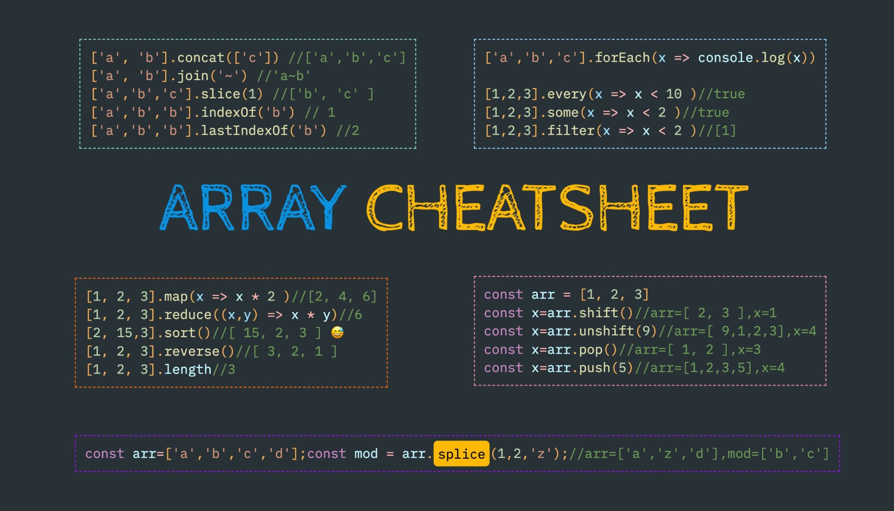

# Week 2 - Challenge 4

## Array methods

Implementa, por parejas, una clase SkylabArray que simule el comportamiento de un Array y que tenga estos métodos y propiedades:

- length
- push
- some
- find
- filter
- map

Testea los métodos.

# Example

